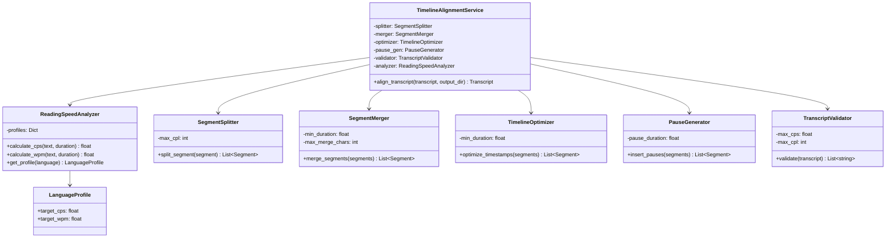
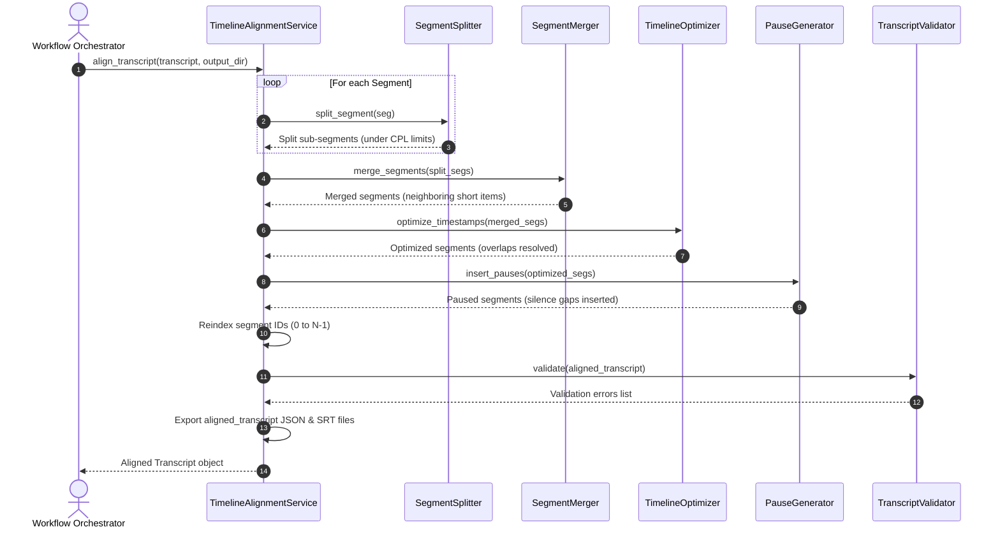

# AutoShort Studio - Sprint 9 Timeline Alignment Architecture

This document describes the architectural design, workflows, and diagrams of the Timeline Alignment Engine.

---

## 1. Timeline Alignment Architecture

The Timeline Alignment Engine occupies the middle layer of the transcription pipeline:

```
[Import Engine] -> [Speech Engine] -> [Translation Engine] -> [Alignment Engine] -> [TTS Engine] -> [Subtitle Engine] -> [Render Engine]
```

It takes raw or translated transcripts and processes them to ensure timing precision and subtitle readability.

---

## 2. Module Dependency Diagram

The alignment engine modules cooperate sequentially to process transcripts:

```
[TimelineAlignmentService]
   │
   ├──> [SegmentSplitter]
   ├──> [SegmentMerger]
   ├──> [TimelineOptimizer]
   ├──> [PauseGenerator]
   ├──> [TranscriptValidator]
   └──> [ReadingSpeedAnalyzer]
```

---

## 3. Class Diagram

The class diagram below shows the relationships between our alignment classes:



---

## 4. Sequence Diagram

This trace maps the alignment pipeline from the initial call to splitting, merging, timing optimization, pauses, validation, and file exports.



---

## 5. Workflows & Subsystem Designs

### Reading Speed Analyzer
- CPS: `characters_count / duration`
- WPM: `(words_count / duration) * 60.0`
- Configurable profiles allow the engine to apply different reading speed limits based on the target language.

### Timeline Optimizer
- Adjusts segment timings to prevent overlap collisions and correct negative or zero durations.
- If a segment overlaps with the previous segment (`start < prev.end`), its start time is shifted to match the previous end time.
- If the shift makes the segment duration shorter than `min_duration`, the segment's end time is pushed forward to preserve the minimum duration, triggering a cascading shift for subsequent segments.

### Segment Splitter
- Long segments are split using space boundaries to prevent wrapping issues.
- If word timestamps are present, the splitter uses them for precise timings instead of relying on text ratio estimations.

### Segment Merger
- Merges consecutive short segments (duration under `min_duration`) to improve subtitle readability.
- Adjacent segments are merged only if their combined text fits within maximum character limits.

### Pause Generator
- Inserts a configurable silence gap (`pause_duration`) between segments to ensure natural pacing.
- The start time of the next segment is shifted forward if the gap is smaller than the threshold. The segment's end time is shifted by the same amount to preserve its duration.

### Transcript Validator
- Audits transcripts to identify timeline errors and rate limit violations (duplicate IDs, overlaps, empty texts, CPL/CPS violations).

### Export Workflow
- Saves the final transcript as a JSON file (preserving word boundaries and confidences) and an SRT file (for subtitle rendering).

---

## 6. Extension Points & Future Compatibility

* **Custom Alignment Adapters**: The engine can be extended with machine learning-based alignment models (e.g. forced alignment using Montreal Forced Aligner).
* **Advanced Subtitle Layouts**: Support for multi-line subtitles and position tags can be added to the export formats.
* **Variable Pause Durations**: The pause generator can be updated to insert longer pauses at sentence boundaries (punctuation marks) and shorter pauses at comma breaks.
