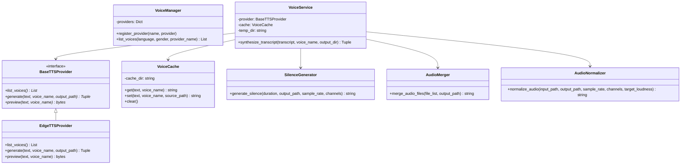
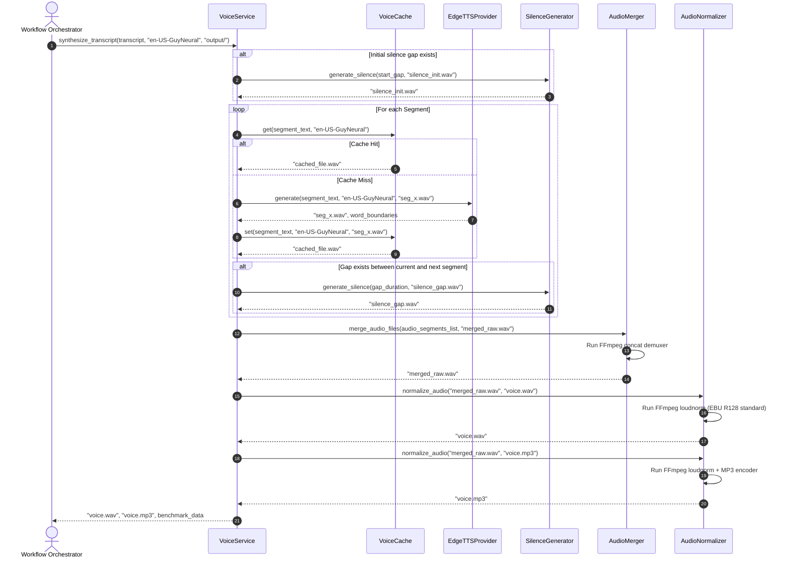

# AutoShort Studio - Sprint 10 Voice Engine Architecture

This document describes the architectural design, workflows, and diagrams of the Voice Synthesis Engine.

---

## 1. Voice Engine Architecture

The Voice Synthesis Engine sits between the Timeline Alignment Engine and the Subtitle Engine:

```
[Alignment Engine] -> [Voice Synthesis Engine] -> [Subtitle Engine] -> [Render Engine]
```

It takes aligned segments and generates speech files, placing them at their respective start times and inserting silence clips in the timeline gaps.

---

## 2. Module Dependency Diagram

The voice engine modules cooperate to synthesize audio files:

```
[VoiceService]
   │
   ├──> [BaseTTSProvider] (EdgeTTSProvider)
   ├──> [VoiceCache]
   ├──> [SilenceGenerator] (ffmpeg)
   ├──> [AudioMerger]      (ffmpeg concat)
   └──> [AudioNormalizer]  (ffmpeg loudnorm)
```

---

## 3. Class Diagram

The class diagram below shows the relationships between our voice synthesis classes:



---

## 4. Sequence Diagram

This trace maps the voice synthesis process from the initial call to caching, silence gap generation, audio merging, and loudness normalization.



---

## 5. Workflows & Subsystem Designs

### Voice Generation Workflow
- Takes aligned segments and loops through them to synthesize speech.
- Calls registered providers to generate speech files for each segment.

### Cache Workflow
- Performs an MD5 hash check using: `voice_name:segment_text`.
- If a cached file is found in the cache directory, it is reused, avoiding redundant provider calls.
- If not found, a new speech file is synthesized and saved to the cache.

### Silence Generation Workflow
- Runs FFmpeg's `anullsrc` virtual filter to generate silence clips matching the target sample rate and channels.
- These silence clips are used to fill timeline gaps between segments.

### Audio Merge Workflow
- Writes the list of audio clips (speech segments and silence gaps) to a temporary text file.
- Runs FFmpeg's `concat` demuxer with stream copy parameters (`-c copy`) to merge the clips without re-encoding them.

### Audio Normalization Workflow
- Runs FFmpeg's `loudnorm` filter (EBU R128 standard) to normalize the volume of the merged audio track.
- Resamples the audio to 16kHz and downmixes it to mono.

---

## 6. Extension Points & Future Compatibility

* **Additional TTS Providers**: Implement `BaseTTSProvider` to support cloud-based providers (e.g. ElevenLabs, OpenAI TTS, AWS Polly).
* **Multi-Voice Transcripts**: Support using different voices for different segments within a single transcript.
* **Variable Speech Rates**: Add support for speed rate configuration parameters (e.g. speeding up speech to fit segment durations).
