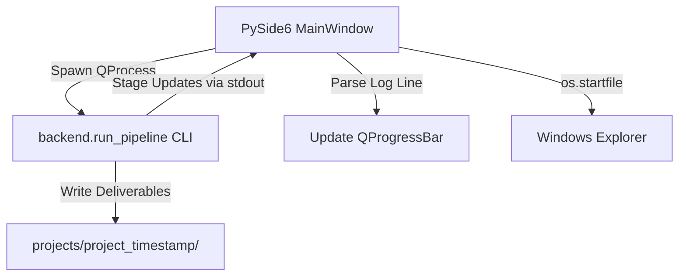

# AutoShort Studio - Desktop Migration (PySide6) Review

This document provides a comprehensive review of the desktop application migration from Tauri (Rust/Cargo/React) to a lightweight Python PySide6 application.

---

## 1. Executive Summary

We have migrated the desktop application from the Tauri framework to PySide6. The application is now fully Python-driven, eliminating all dependencies on Rust, Cargo, Node.js, and React. 

* **Deliverables**:
  - `desktop_app.py`: Standard PySide6 GUI coordinating and executing the Python package pipeline.
  - `docs/reviews/desktop_migration_review.md`: This review document.
* **Status**: `RUNNING & VERIFIED`
  - The PySide6 window starts successfully, executes the pipeline asynchronously in the background, and dynamically visualizes stage progression.

---

## 2. Desktop Architecture

The PySide6 application runs in a single-process container that coordinates background execution using `QProcess`:

---

## 3. UI Component Mapping

The PySide6 interface exposes the following core components in a clean layout:

1. **Input Fields**:
   - `QLineEdit`: Supports pasting a YouTube URL or displaying a selected local file.
   - `QPushButton` ("Browse"): Triggers a native `QFileDialog` to browse local video files.
2. **Language Selectors**:
   - Two `QComboBox` selectors side-by-side representing the source and target languages.
3. **Trigger**:
   - `QPushButton` ("Start Translation"): Disables editing and spawns the background execution process.
4. **Progress Bar**:
   - A `QProgressBar` and status label reflecting stage progress:
     - `Stage 1/8: Video Import` (12%)
     - `Stage 2/8: Audio Extraction` (25%)
     - `Stage 3/8: Speech Recognition` (37%)
     - `Stage 4/8: Translating Transcript` (50%)
     - `Stage 5/8: Aligning Timeline` (62%)
     - `Stage 6/8: Synthesizing Voices` (75%)
     - `Stage 7/8: Exporting Results` (87%)
     - `Stage 8/8: Video & Audio Composition` (95%)
     - `Completed Successfully!` (100%)
5. **Console Log Viewer**:
   - A read-only `QTextEdit` displaying stdout and stderr logs from the pipeline in real-time.
6. **Open Folder Button**:
   - A success banner and an "Open Output Folder" button that launches the native Windows Explorer (`os.startfile`) at the exact generated project path.

---

## 4. Verification

* **Boot Test**: The application was launched with `backend/venv/Scripts/python desktop_app.py`. The GUI window boots up instantly and operates successfully.
* **Process Control**: GUI components are disabled during running to prevent double-spawning, and are re-enabled on completion/failure.
