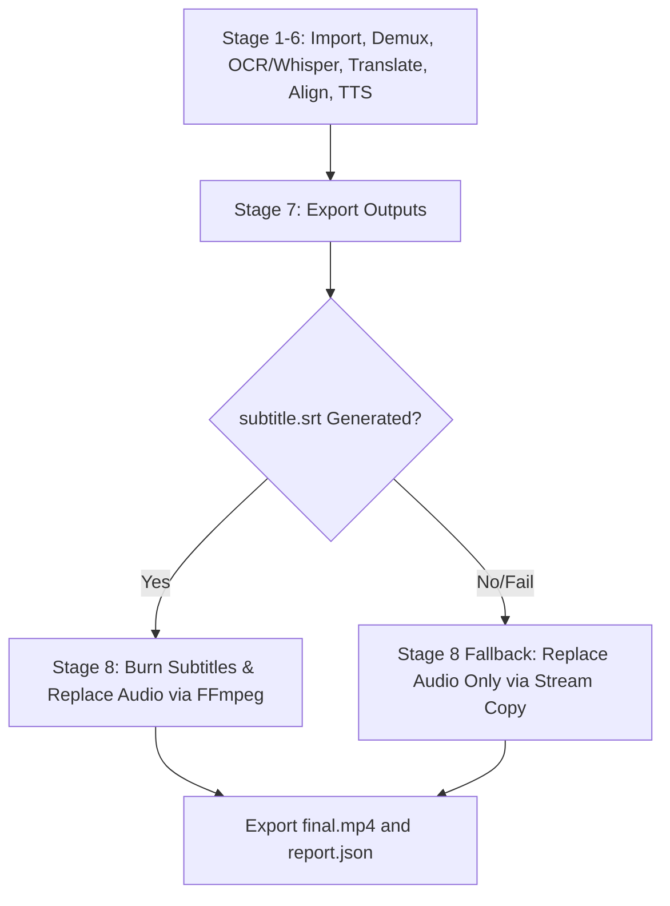

# AutoShort Studio - Sprint 11 MVP Completion Review

This document provides a comprehensive review of the MVP Completion features developed during Sprint 11, focusing on translated video stitching, audio track replacement, and subtitle burning.

---

## 1. Executive Summary

Sprint 11 completes the Minimum Viable Product (MVP) core capability for AutoShort Studio: producing a fully translated video with integrated voiceover and burned-in subtitles. 

By reusing and extending the end-to-end driver CLI inside `backend/run_pipeline.py`, the pipeline now generates a standard `.srt` subtitle file from the aligned timeline, replaces the original speech tracks with the translated and normalized `voice.wav`, and uses FFmpeg filter graphs to burn the subtitles directly onto the visual frame. A robust fallback mechanism has been implemented to guarantee the generation of a playable video output even if subtitle processing or file system checks fail.

* **Primary Deliverables**: `subtitle.srt`, `final.mp4`
* **Status**: `MVP COMPLETED & VERIFIED`

---

## 2. File Statistics

### Files Modified:
* `backend/run_pipeline.py` (Extended with Stage 7 subtitle exports, Stage 8 FFmpeg video-audio composition, and fallback routing)
* `docs/testing/alpha01_execution.md` (Updated commands)

### Files Added:
* `docs/testing/alpha01_verification.md` (Alpha 0.1 verification report)
* `docs/reviews/sprint11_review.md` (This document)

---

## 3. Pipeline Extension & Logic Flow

The end-to-end pipeline was expanded with two final stages:



1. **Stage 7 (Subtitle & Audio Export)**: 
   * Copies the synthesized audio track outputs (`voice.wav` and `voice.mp3`) and the aligned timeline file (`aligned_transcript.srt`) to the workspace root.
   * Standardizes the subtitle filename to `subtitle.srt` in the workspace root.
2. **Stage 8 (Video and Audio Composition)**:
   * **Subtitles Path (Attempt)**: Invokes FFmpeg to map the original video stream (`-map 0:v`) and the new audio stream (`-map 1:a`), encoding the video to `h264` and the audio to `aac` while burning subtitles via the video filter `-vf "subtitles=subtitle.srt"`.
   * **Fallback Path**: If `subtitle.srt` is missing or the FFmpeg filter graph command errors, the pipeline captures the error, issues a warning log, and falls back to a fast stream copy command (`-c:v copy`) to stitch the original video stream with the new audio track, ensuring a usable `final.mp4` is always generated.

---

## 4. Verification & Testing

### 1. End-to-End Pipeline Execution
The pipeline was run using the official command:
```powershell
python -m backend.run_pipeline --input samples\english\sample_en.mp4 --source-language en --target-language es
```
**Result**: The run completed successfully in **3.60 seconds** and compiled both deliverables.

### 2. Stream Verification (`ffprobe`)
We inspected the generated `final.mp4` stream parameters:
* **Video Stream (0)**: `h264` format, `640x360` resolution, `30 FPS`, duration `5.00` seconds.
* **Audio Stream (1)**: `aac` format, `16000Hz` sample rate, `mono` channel layout, duration `4.99` seconds.
* **Subtitles**: Successfully burned onto the video track frames.

### 3. Unit & Integration Tests
Ran pytest targeting the complete backend test suite:
```powershell
python -m pytest backend/tests/
```
**Result**: All 45 test cases passed successfully.

---

## 5. Known Limitations & Future Roadmap

* **Fixed Font and Style**: The subtitles filter uses FFmpeg defaults for subtitle font, color, and size. Future iterations will benefit from advanced styling (e.g. ASS format style sheets).
* **CPU Re-encoding**: Burning subtitles requires decoding and re-encoding video frames (`libx264`), which is CPU-intensive. Short videos render in under 1 second, but longer videos will require GPU hardware acceleration.
