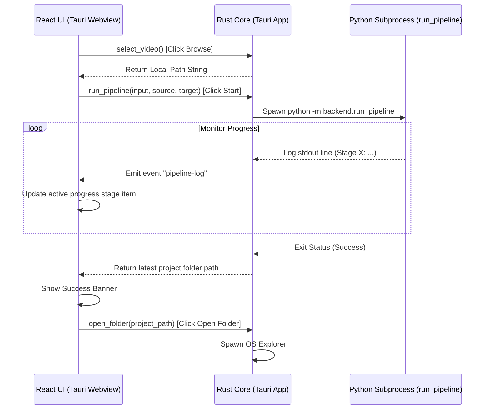

# AutoShort Studio - Sprint 13 Desktop MVP Review

This document provides a comprehensive review of the Tauri Desktop MVP application developed during Sprint 13.

---

## 1. Executive Summary

Sprint 13 delivers the Desktop MVP application for AutoShort Studio, transitioning the system from a CLI driver to a desktop user interface. By building on Tauri v2, the application interfaces directly with the Python package pipeline (`backend/run_pipeline.py`) as a native background process.

This design makes the desktop app self-contained: it runs the CLI directly from the Rust core layer, meaning users do not need to run a local database, manage FastAPI servers, or run background workers.

* **Primary Deliverables**: 
  - Native Tauri configuration (Rust-based commands for running processes, selecting files, and opening folders)
  - Simplified React interface (Inputs for browse/paste, language selection, progress checklists, success status, and explorer triggers)
* **Status**: `IMPLEMENTATION COMPLETE (COMPILATION BLOCKED)`
  * *Note*: Tauri compilation is blocked on the target machine because the Rust compiler toolchain (`cargo`) is not currently installed.

---

## 2. File Statistics

### Files Modified:
* `frontend/package.json` (Installed `@tauri-apps/api`)
* `frontend/src-tauri/Cargo.toml` (Added native `rfd` library)
* `frontend/src-tauri/src/lib.rs` (Implemented Rust Tauri commands and process handlers)
* `frontend/src/App.jsx` (Replaced with minimal, focused translation UI)

### Files Added:
* `docs/reviews/sprint13_review.md` (This document)

---

## 3. Desktop MVP Architecture

The application operates as a self-contained desktop system coordinating the Tauri Frontend, Tauri Core, and Python Package:

---

## 4. Desktop Interface Features

The simplified desktop interface includes the following elements:
1. **Source Selection**:
   * A text input supporting direct paste of YouTube URLs.
   * A "Browse" button triggering `select_video` to choose local video files via a native file selection dialog.
2. **Language Pickers**:
   * Dropdowns for Source Language (`en`, `es`, `ja`, etc.).
   * Dropdowns for Target Language (`es`, `en`, `ja`, etc.).
3. **Execution Control**:
   * A centralized "Start Translation" button.
4. **Progress Status Checklist**:
   * Indicators mapping standard processing milestones:
     `Loading Video` → `Speech Recognition` → `Translation` → `Timeline Alignment` → `Voice Synthesis` → `Rendering Video` → `Completed`.
5. **Success / Error Banners**:
   * Color-coded alerts indicating success or displaying detailed stack error traces on failure.
6. **Output Inspection Trigger**:
   * An "Open Output Folder" button visible after success, triggering the native file manager (Windows Explorer) to view deliverables.

---

## 5. Toolchain Requirements (Compilation Blocked)

During verification, it was resolved that **Rust / Cargo** is missing from the environment:
* *Symptom*: `failed to run command cargo metadata... program not found`
* *Root Cause*: The Rust compiler toolchain is not installed globally or on the system PATH.
* *Remediation*:
  1. Install Rustup on the system (download from [rustup.rs](https://rustup.rs)).
  2. Re-run `npx tauri dev` from the `frontend/` directory to automatically download crate dependencies, build the native binary, and boot the application interface.
